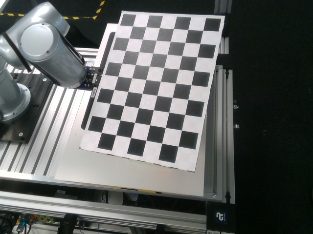

# handeye_calibration
This repository uses OpenCV and chessboard for hand-eye calibration of RealSense camera and robot.
<div style="display: flex; justify-content: center; align-items: center">
    
</div>

## Setup
- Install dependences
    ```
    conda create -n calibration
    conda activate calibration
    pip install -r requirements.txt
    ```

- Setup the Diana API. 

    We use Diana 7 robot arm. If your robot is different, change the code in capture_img_pose.py.

- Prepare and setup chessboard.

## Usage

- step 1. Store 20-30 chessboard images and cooresponding robot arm poses
    ```
    python capture_img_pose.py
    ```
    Press 's' to store one image and pose. Keep the chessboard fully visible to the camera, changing its position and orientation each time. Press 'q' to finish capturing. Examples are saved in [handeye_img_pose/img](handeye_img_pose/img/).

- step 2. run calibration

    Change the sizes according to your chessboard in run_calibaration.py
    ```
    python run_calibaration.py
    ```
    return camera to base matrix if eye to hand

    return camera to gripper matrix if eye in hand
